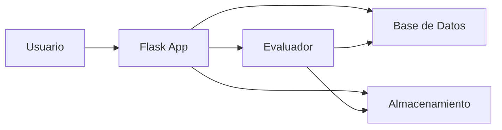

# 🔐 Laboratorio de Contraseñas  https://laboratorio-chido.onrender.com/
### *"El Hacker Amable"* 

[](https://www.python.org/)
[](https://flask.palletsprojects.com/)
[](LICENSE)
[]()

> Un laboratorio interactivo para analizar la seguridad de contraseñas, con demos en vivo y visualizaciones chidas. Creado como proyecto final de Programación I.

---

## 🌟 Características

### 🔍 Análisis de Seguridad
- **Hashing SHA-256**: Protección criptográfica de contraseñas
- **Lista Negra**: Detección de +20 contraseñas comunes
- **Sistema de Puntuación**: Evaluación basada en reglas (longitud, complejidad, caracteres especiales)
- **Entropía de Shannon**: Medición científica de la aleatoriedad

### 🎨 Interfaz Web Interactiva
- **Demos en Vivo**:
  - 🔐 Hasheador SHA-256 en tiempo real
  - ✅ Checklist de seguridad dinámico
  - 💾 Simulador de logs de memoria
  - 🔄 Visualizador de flujo de datos
- **Diseño Premium**: Glassmorphism, efectos neón, y paleta "Friendly Hacker"
- **Syntax Highlighting**: Bloques de código coloreados con Prism.js

### 📊 Reportes y Estadísticas
- Generación de reportes en texto
- Gráficos de distribución y entropía
- Historial de análisis

### 🛠️ Generador de Contraseñas
- Contraseñas seguras aleatorias
- Configuración de longitud y complejidad

---

## 📸 Capturas de Pantalla

### Página Principal
La interfaz principal permite evaluar contraseñas y generar nuevas de forma segura.

### Demos Interactivas

#### 🗄️ Base de Datos - Hasheador SHA-256
Observa cómo tu texto se transforma en un hash único en tiempo real.

#### 🧠 Evaluador - Checklist de Seguridad
Visualiza qué requisitos cumple tu contraseña mientras escribes.

#### 💾 Almacenamiento - Simulador de Logs
Simula el guardado de datos en la memoria del servidor.

#### 🖥️ Interfaz - Flujo de Datos
Animación que muestra cómo viaja una petición por el sistema.

---

## 📊 Análisis de Datos

### Distribución de Contraseñas


### Análisis de Entropía


---

## 🚀 Instalación

### Requisitos
- Python 3.11+
- pip

### Pasos

1. **Clonar el repositorio**
```bash
git clone https://github.com/Charly-bite/laboratorio_chido.git
cd laboratorio_chido
```

2. **Instalar dependencias**
```bash
pip install flask matplotlib
```

3. **Ejecutar la aplicación web**
```bash
python3 app.py
```

4. **Abrir en el navegador**
```
http://127.0.0.1:5000
```

---

## 💻 Uso

### CLI (Línea de Comandos)
```bash
python3 password_lab.py
```

Opciones del menú:
1. Evaluar una contraseña
2. Ver contraseñas analizadas
3. Mostrar estadísticas
4. Generar contraseña segura
5. Exportar reporte
6. Salir

### Web App
Navega a `http://127.0.0.1:5000` y explora:
- **Inicio**: Evalúa y genera contraseñas
- **Base de Datos**: Demo de hashing
- **Evaluador**: Demo de checklist
- **Almacenamiento**: Demo de logs
- **Interfaz**: Demo de flujo

---

## 🏗️ Arquitectura



### Módulos

| Módulo | Archivo | Responsabilidad |
|--------|---------|-----------------|
| 🗄️ Base de Datos | `database.py` | Lista negra y hashing SHA-256 |
| 🧠 Evaluador | `evaluator.py` | Puntuación y entropía |
| 💾 Almacenamiento | `storage.py` | Historial y reportes |
| 🎨 Interfaz | `app.py` | API Flask y orquestación |
| 🖼️ Frontend | `templates/`, `static/` | UI interactiva |

---

## 🎨 Paleta de Colores

```css
--bg-dark: #0f172a;        /* Fondo oscuro */
--accent-primary: #38bdf8;  /* Cyan - Tecnológico */
--accent-secondary: #a855f7; /* Purple - Creativo */
--success: #4ade80;         /* Matrix Green */
```

---

## 📚 Documentación Técnica

### Sistema de Puntuación
- **Longitud ≥ 8**: +20 puntos
- **Números**: +15 puntos
- **Símbolos**: +25 puntos
- **Mayúsculas**: +15 puntos
- **Minúsculas**: +10 puntos
- **Máximo**: 85 puntos

### Cálculo de Entropía
```python
H = L × log₂(N)
```
Donde:
- `L` = Longitud de la contraseña
- `N` = Tamaño del conjunto de caracteres

---

## 👥 Equipo

Creado con ❤️ y ☕ por:

- **Carlos A.** - Interfaz e Integración
- **Dulce A.** - Sistema de Evaluación
- **Daniel L.** - Almacenamiento y Reportes
- **Fernando P.** - Base de Datos y Hashing

---

## 📄 Licencia

Este proyecto fue desarrollado como parte del curso de Programación I.

---

## 🙏 Agradecimientos

- [NordPass](https://nordpass.com/es/most-common-passwords-list/) - Lista de contraseñas comunes
- [Prism.js](https://prismjs.com/) - Syntax highlighting
- [Flask](https://flask.palletsprojects.com/) - Framework web

---

<div align="center">

**¿Qué tan segura es tu contraseña? ¡Descúbrelo ahora!** 🔐

[Demo en Vivo](#) | [Documentación](#) | [Reportar Bug](https://github.com/Charly-bite/laboratorio_chido/issues)

</div>
